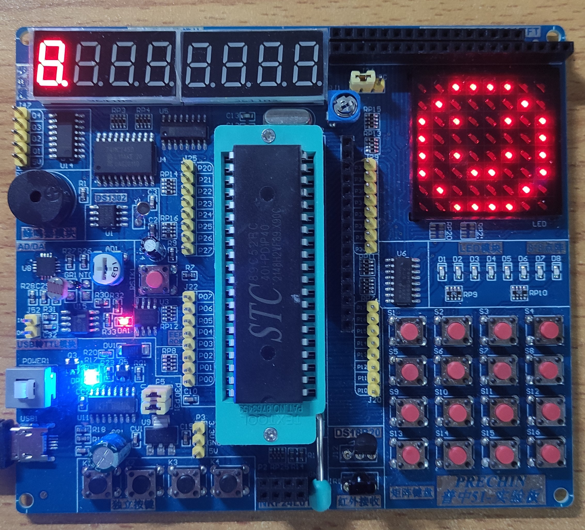

# STC89C52RC_Modules_TestExample

STC89C52-MCU's Modules Demo

---

---

### WorkSpace Environment

```bash
# Keil uVision5
# STC-ISP -v6.88R
```

---



---

### Modules

- [s2e1 - 点亮一个 LED](s2e1/)
- [s2e2 - LED 闪烁](s2e2/)
- [s2e3 - LED 流水灯](s2e3/)
- [s2e4 - LED 流水灯 Plus](s2e4/)
- [s3e1 - 独立按键控制 LED 亮灭](s3e1/)
- [s3e2 - 独立按键控制 LED 状态](s3e2/)
- [s3e3 - 独立按键控制 LED 显示二进制](s3e3/)
- [s3e4 - 独立按键控制 LED 移位](s3e4/)
- [s4e1 - 静态数码管显示](s4e1/)
- [s4e2 - 动态数码管显示](s4e2/)
- [s5e2 - LCD1602 调试工具](s5e2/)
- [s6e1 - 矩阵键盘](s6e1/)
- [s6e2 - 矩阵键盘密码锁](s6e2/)
- [s7e1 - 定时器, 按键控制 LED 流水灯模式](s7e1/)
- [s7e2 - 定时器时钟](s7e2/)
- [s8e1 - 串口向电脑发送数据](s8e1/)
- [s8e2 - 电脑通过串口控制 LED](s8e2/)
- [s9e1 - LED 点阵屏显示图形](s9e1/)
- [s9e2 - LED 点阵屏显示流动动画](s9e2/)
- [s9e3 - LED 点阵屏显示逐帧动画](s9e3/)
- [s10e1 - DS1302 时钟](s10e1/)
- [s10e2 - DS1302 可调时钟](s10e2/)
- [s11e1 - 蜂鸣器, 独立按键控制蜂鸣器发声](s11e1/)
- [s11e2 - 蜂鸣器播放音乐](s11e2/)

---
